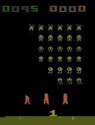
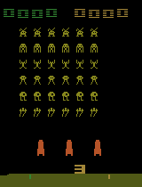

# SpaceInvadersRL

Welcome to the SpaceInvadersRL repository! This project is part of a reinforcement learning assignment where two different models, Deep Q-Network (DQN) and Proximal Policy Optimization (PPO), are trained to play the classic game Space Invaders. The repository includes implementation of both models along with visual demonstrations of their performance.

## Deep Q-Network (DQN) Model

The DQN model uses a convolutional neural network (CNN) policy to interact with the Space Invaders environment. DQN is a value-based reinforcement learning algorithm that learns to estimate the action-value function (or Q-function) for each state-action pair in a discrete action space. Here's a gif demonstrating the performance of the trained DQN model:

  

## Proximal Policy Optimization (PPO) Model

The PPO model in this repository is implemented with a custom policy that combines convolutional neural networks (CNN) and long short-term memory (LSTM) units. PPO is a policy gradient method for reinforcement learning which optimizes a "surrogate" objective function via stochastic gradient ascent. Typically, PPO is used for environments with either continuous action spaces or high-dimensional discrete action spaces. Below is a gif showing the results of the trained PPO model:

  

