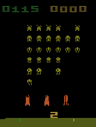

# SpaceInvadersRL

This project is part of a reinforcement learning assignment where two different models, Deep Q-Network (DQN) and Proximal Policy Optimization (PPO), are trained to play Space Invaders. The repository includes implementation of both models and gifs of their performance.

## Model Demonstrations

Below are the demonstrations of the trained models, categorized by model type and the policy used:

| Model Type | Policy Type  | GIF  |
|------------|--------------|--------------------|
| DQN        | CNN   | 

 |
| DQN        | MLP   | 

 |
| PPO        | CNN   | 

 |
| PPO        | CNN+LSTM | 

 |
| PPO        | MLP | 

 |
