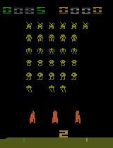

# SpaceInvadersRL

This project is part of a reinforcement learning assignment where two different models, Deep Q-Network (DQN) and Proximal Policy Optimization (PPO), are trained to play Space Invaders. The repository includes implementation of both models and gifs of their performance.

## Model Demonstrations

Below are the demonstrations of the trained models, categorized by model type and the policy used:

| Model Type | Policy Type  | Demonstration GIF  |
|------------|--------------|--------------------|
| DQN        | CNN Policy   | 

 |
| PPO        | CNN Policy   | 

 |
| PPO        | CNN + LSTM Policy | 

 |
| PPO        | MLP Policy   | 

 |

## Deep Q-Network (DQN) Model

The DQN model uses a convolutional neural network (CNN) policy to interact with the Space Invaders environment. DQN is a value-based reinforcement learning algorithm that learns to estimate the action-value function (or Q-function) for each state-action pair in a discrete action space.

## Proximal Policy Optimization (PPO) Model

The PPO model in this repository is implemented with various policies including CNN, CNN+LSTM, and MLP. PPO is a policy gradient method for reinforcement learning which optimizes a "surrogate" objective function via stochastic gradient ascent. This model is used for environments with either continuous action spaces or high-dimensional discrete action spaces.
